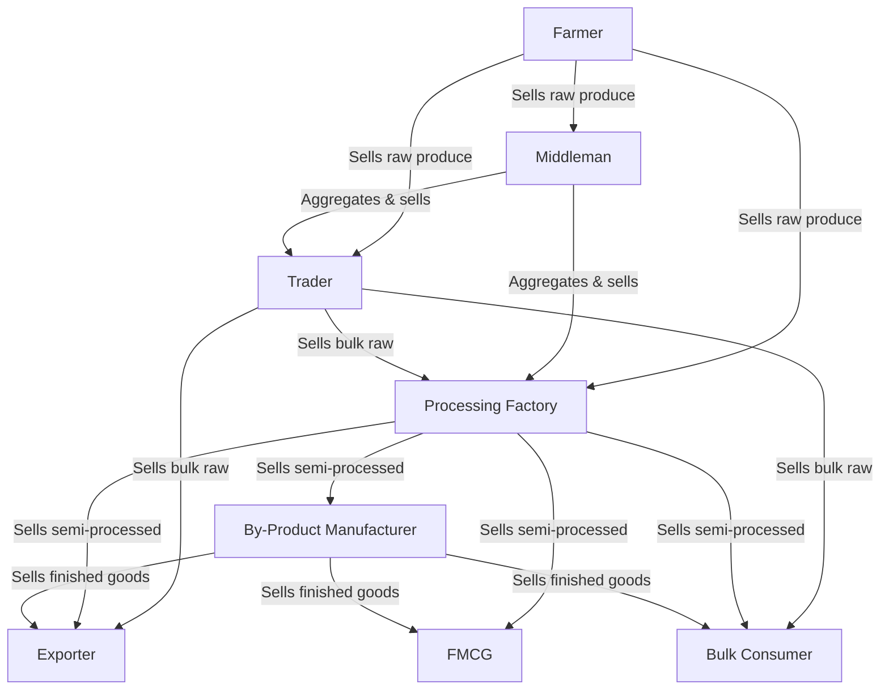
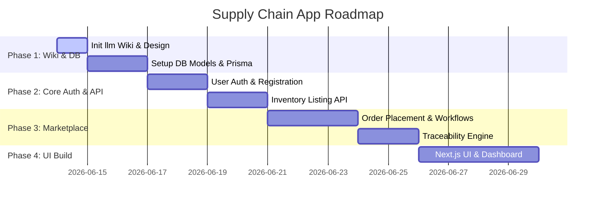

# Farmer Supply Chain Application (End-to-End Plan)

This document outlines the business analysis, entity modeling, flow validation, database design, and implementation roadmap for the Farmer Supply Chain application.

---

## User Review Required

> [!IMPORTANT]
> To ensure the application matches your exact business expectations, please review the proposed additions (Logistics, Quality Assurance, and Batch Traceability) and the relational database schema below.
> 
> Set the `/grill-me` command or reply to this plan if you want to align on any specific workflow adjustments before we write any code.

---

## Open Questions

> [!WARNING]
> 1. **Payment & Credit terms**: In real life, farmers usually require immediate cash/digital payment, whereas middlemen, traders, and FMCG work on 15/30/60 day credit cycles. Does this application need to track credit limits and outstanding invoices/ledgers?
> 2. **Contract Farming vs Spot Trading**: Will transactions be purely "spot" (immediate listing and buying) or do we also need "contracts" (forward agreements between farmers and FMCG/processing factories for a future harvest)?
> 3. **Hosting & DB preferences**: Since this is a Next.js 16 app with Express potentially running on the backend, do you have a database preference (e.g., PostgreSQL via Prisma/Drizzle, or MongoDB)? We recommend PostgreSQL for strict relational consistency in transactions.

---

## Business Analysis & Entity Review

### 1. Am I Right in the Structure?
Yes, your structure accurately models the major players in agricultural commerce. By classifying players based on their taxation/regulatory status (Middleman = unregistered, Trader = registered GST holder) and their level of industrial value addition (Processing Factory = raw-to-semi-processed, By-product Manufacturer = semi-processed-to-finished goods), you have laid down a very solid foundation.

Here is a quick verification of the roles:
*   **Farmer**: Primary producer. Focuses on crop cycles, yields, and initial sales.
*   **Middleman (Arhtiya / Commission Agent)**: Essential for smallholders. They aggregate small, non-standardized quantities. By remaining unregistered, they avoid compliance overheads for small-scale local deals.
*   **Trader (Wholesaler / Distributor)**: The formal hub. They absorb financial risk, manage short-term storage, handle logistics billing, and transact with formal invoices.
*   **Processing Factory**: Focuses on mass transformation (e.g., peanuts to oil, wheat to flour). Their operations are continuous and require steady raw material supplies.
*   **By-Product Manufacturer**: Focuses on consumer product generation (e.g., processing flour/oil into biscuits/chips).
*   **FMCG, Exporters, and Bulk Consumers**: High-volume end-buyers. They prioritize quality consistency, traceability, and bulk supply agreements.

---

### 2. Did I Miss Anything?
In a real-life agricultural supply chain, several silent facilitators are critical for operations. To make this app a robust platform, we should consider introducing the following entities:

1.  **Logistics / Transporters**: Agricultural goods are heavy, bulky, and highly perishable. The flow of goods relies on booking trucks, generating dispatch challans, tracking transit, and confirming delivery. A dedicated **Transporter** entity or transport service booking is essential.
2.  **Quality Assessor / Testing Labs**: Big buyers (like FMCG and Exporters) will not purchase raw materials or processed foods without a certified quality check (e.g., moisture content, size, color grading, pesticide residue). A **Quality Assessor** entity can verify and certify inventory batches.
3.  **Warehouses / Cold Storages**: Since crop harvests are seasonal but consumption is year-round, storage providers are vital. A **Warehouse Operator** entity tracks deposits, storage rentals, and issues warehouse receipts.
4.  **Batch Traceability (System Feature)**: A major demand for FMCG and Exporters is tracing the supply chain backwards. For example, if a bag of potato chips has a quality issue, the FMCG wants to trace the batch ID to the By-product Manufacturer -> Processing Factory -> Trader -> Middleman -> original Farmers.

---

### 3. Is the Flow I Drawn Correct?
Your drawn flow is highly accurate. It represents the actual pathways of agricultural commerce. Here is a verification of the relationships:

**Key Strengths of this Flow:**
*   It honors the **direct-to-factory** path (Farmer -> Processing Factory), which is increasingly common in modern contract farming.
*   It honors the **aggregation** path (Farmer -> Middleman -> Trader), which is standard for smallholder farming.
*   It honors the **value-addition stages** (Processing Factory -> By-Product Manufacturer -> FMCG).

---

## Proposed Database Architecture & Entities

To build this application, we need a relational model. Below is the proposed database schema:

### 1. Users & Roles
*   `User`: `id`, `name`, `email`, `password_hash`, `role` (FARMER, MIDDLEMAN, TRADER, PROCESSOR, MANUFACTURER, FMCG, EXPORTER, BULK_CONSUMER, TRANSPORTER, ASSESSOR), `gst_number` (optional), `license_number` (optional), `address`, `phone`, `created_at`.

### 2. Inventory & Batches
*   `InventoryItem`: `id`, `owner_id` (FK to User), `title`, `description`, `category` (RAW, SEMI_PROCESSED, FINISHED), `quantity`, `unit` (KGS, TONS, BAGS), `price_per_unit`, `location`, `quality_grade` (A, B, C, or UNGRADED), `traceability_parent_id` (FK to InventoryItem - to trace which batch this item was created from).

### 3. Orders & Transactions
*   `Order`: `id`, `buyer_id` (FK to User), `seller_id` (FK to User), `status` (PENDING, ACCEPTED, IN_TRANSIT, DELIVERED, CANCELLED), `total_amount`, `payment_status` (UNPAID, ESCROW, PAID), `created_at`.
*   `OrderItem`: `id`, `order_id` (FK to Order), `inventory_item_id` (FK to InventoryItem), `quantity`, `price_per_unit`.

### 4. Logistics & Shipments
*   `Shipment`: `id`, `order_id` (FK to Order), `transporter_id` (FK to User), `vehicle_number`, `status` (DISPATCHED, IN_TRANSIT, DELIVERED), `dispatch_date`, `delivery_date`, `tracking_data` (JSON).

### 5. Quality Certificates
*   `QualityReport`: `id`, `inventory_item_id` (FK to InventoryItem), `assessor_id` (FK to User), `parameters` (JSON: moisture, purity, size), `grade_assigned`, `certified_at`.

---

## Creation Plan for `llm Wiki` Files

To keep the LLM fully in sync with the codebase during implementation, we will initialize the `llm Wiki` folder with the following markdown files:

1.  **[llm Wiki/project-overview.md](file:///c:/Users/jeswa/Downloads/farmerpoc/llm%20Wiki/project-overview.md)**
    *   *Purpose*: High-level summary of the app, target user roles, and value proposition.
2.  **[llm Wiki/project-knowledge.md](file:///c:/Users/jeswa/Downloads/farmerpoc/llm%20Wiki/project-knowledge.md)**
    *   *Purpose*: Detailed database schema, tech stack patterns, routing guide, and API definitions.
3.  **[llm Wiki/project-status.md](file:///c:/Users/jeswa/Downloads/farmerpoc/llm%20Wiki/project-status.md)**
    *   *Purpose*: Roadmap, current checklist, completed items, and outstanding issues.

---

## Technical Action Plan

### Phase 1: Documentation & DB Setup
*   Create the `llm Wiki` files.
*   Setup database configurations (Prisma or database access layer).

### Phase 2: Role-based Authentication & Registration
*   Build registration flow containing custom fields depending on the selected role (e.g., GST certificate upload for Traders, land-holding record details for Farmers).

### Phase 3: Marketplace and Traceability
*   Implement listing and purchase flow.
*   Implement trace engine: recursive database queries matching child inventory back to raw parent inventory.

---

## Verification Plan

### Automated Tests
- Test endpoints for registering each user type.
- Test batch aggregation and traceability tracking algorithms.

### Manual Verification
- Simulated workflow walkthrough: Create a Farmer -> List Potato Crop -> Middleman Aggregates -> Trader Buys and Generates GST Invoice -> Processing Factory Buys & Processes -> FMCG buys -> Verify Traceability matches all the way back to the Farmer.
